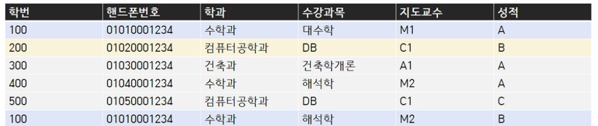

<데이터베이스 모델링에서 사용되는 용어 정리>

| 데이터베이스 용어 | 모델링 용어 |
| --- | --- |
| 테이블 Table | 엔티티 Entity |
| 칼럼(열) Column | 속성 Attribute |
| 튜플(행) Tuple | 인스턴스 Instance |

 

### ERD (Entiy Relationship Diagram)

엔티티Entity 간의 관계Relation를 설명해주는 다이어그램Diagram

DB의 구조를 한눈에 파악할 수 있음

- 개념적 데이터 모델 : 엔터티와 엔터티 간의 관계, 주요 속성만을 보여준다. 비즈니스 사용자가 쉽게 이해할 수 있는 수준의 단순화된 형태
    

    
    
- 논리적 데이터 모델 : 개념적 모델을 구체화한 것으로 데이터타입, 외래키, 제약 조건 등을 상세하게 정의해 실제 데이터베이스 설계를 반영한다. 개발자나 데이터베이스 설계자가 사용할 수 있는 수준으로, 실제 데이터베이스를 구축하기 위한 기초를 제공

 

### ERD Notation

- Entity : 직사각형
- Attribute  : 타원
- Relationship : 마름모
- Primary Key : 밑줄

위 사진을 보고 알 수 있는 정보

- Product 테이블 : name (pk), category, price
- Company 테이블 : name (pk)
- 두 테이블의 관계 : Company가 Product를 만듦

### Relationship

**One to One : 일대일 관계**

- 예시 : 한 방문마다 한 번의 리뷰만 쓸 수 있을 때
    - `방문기록` 테이블과 `리뷰` 테이블이 있다고 가정해보자. 각 방문은 고유한 방문 ID를 가지고 있으며, 이 방문에 대해 작성할 수 있는 리뷰는 하나뿐이다. `방문기록` 테이블과 `리뷰` 테이블 사이에는 **일대일 관계**가 존재하게 된다. 즉, 각 방문 ID는 단 하나의 리뷰 ID와 연결되고, 그 반대도 마찬가지이다.

**Many to One , One to Many : 다대일 관계**

- 예시 : 사용자가 여러 번 방문할 수 있을 때
    - `사용자` 테이블과 `방문기록` 테이블이 있다고 가정해보자. 한 사용자는 여러 번 방문할 수 있지만, 각 방문기록은 한 사용자에게 속해있다.  `사용자` 테이블과 `방문기록` 테이블에는 **일대다 관계**가 존재하게 된다.  이 경우, `방문기록` 테이블에 `사용자ID` 라는 외래키를 추가하여 각 방문이 어느 사용자에 속하는지 기록한다.
- 보통 다쪽 (예시의 방문기록)에 **외래키**를 추가하여, 다른 일쪽(예시의 사용자)와의 연결이 이루어짐

**Many to Many : 다대다 관계**

- 예시 : 학생이 여러 과목을 수강할 수 있고, 과목도 여러 학생이 수강할 수 있을 때
    - `학생` 테이블과 `과목` 테이블이 있다고 가정해보자. 한 명의 학생은 여러 개의 과목을 수강할 수 있으며, 각 과목도 여러 학생이 수강할 수 있으면 `학생`과 `과목` 테이블 사이에는 **다대다 관계**가 존재하게 된다.

Product는 하나의 Company에 의해서 만들어지고, 하나의 Company는 여러 개의 Product를 만들 수 있다. 

### 테이블을 잘못 설계했을 때 나타나는 이상현상

**갱신이상 UpdateAnomaly**

테이블에서 특정 속성값을 갱신할 때, 중복저장되어있는 속성값 중 하나만 갱신하고, 나머지는 갱신하지 않아서 발생하는 데이터 불일치 현상

room의 한 값을 갱신했을 때, 같은 course와 연결되어있는 room 모두가 갱신되지 않아 이상이 발생한다. 

**삭제이상 DeleteAnomaly**

테이블에서 특정행을 삭제할 때, 원하지 않는 정보까지 삭제되는 현상

**삽입이상 InsertAnomaly**

테이블에서 특정 행을 삽입할 경우 NULL 값이나 원하지 않은 불필요한 정보까지도 삽입해야 하는 현상

- DB 과목을 듣는 학번 500 학생이 성적이 낮게 나와 행정실에서 수강삭제를 요청했을 때, 행정실에서 이 학생의 수강정보를 삭제한다면 학생의 학번, 핸드폰번호, 학과 정보까지 삭제된다. Delete Anomaly 발생
- 건축과 신입생이 들어와 학번600번, 휴대폰번호01060001234를 가졌다. 하지만 아직 신입생이기에 수강신청을 하지 않아 수강내역이 없다. 이때 신입생의 정보를 넣기 위해 수강과목, 지도교수, 성적 칼럼에 null값을 넣거나 값이 비어있다는 것을 알 수 있게 설계자가 고안한 상태코드값을 넣어주어야한다.  Insert Anomaly 발생

### 데이터베이스 정규화

위에서 설명한 이상현상이 발생하지 않도록 데이터베이스를 구성해야 한다. 데이터베이스의 구조를 개선하여 **데이터의 중복을 최소화**하고 **무결성을 유지**하도록 설계하는 과정이 정규화이다. 일반적으로 여러 단계로 나누어 수행되며, 각 단계는 정규형(Normal Form)이라는 기준으로 정의된다. 

### 제1 정규형 (1NF)

**모든 필드는 원자값(atomic value)**이어야 한다. 즉, 각 필드에는 하나의 값만 포함되도록 테이블을 분해한다. 

왼쪽에서 추신수, 박세리는 두 개의 취미를 가지고 있기 때문에 제1 정규형을 만족하지 못한다. 따라서 테이블을 분해해 오른쪽의 테이블로 만들어준다. 

### 제2 정규형(2NF)

 제1정규형을 만족하면서, 기본 키가 아닌 모든 속성이 기본 키에 완전 종속되어야 한다. 즉, 기본키가 여러 개의 속성으로 이루어져있을 때, 나머지 속성들이 기본키 여러 개 중 일부를 통해 결정되면 안된다. 

위 `수강강좌` 테이블에서 기본키는 **(학생번호, 강좌이름)의 복합키**이다. (학생번호, 강좌이름)은 성적을 결정하고 있지만, **강의실은 강좌이름만이 결정**하고 있다. 기본키의 일부를 통해 다른 속성이 결정되므로 제2정규형을 만족하지 못한다. 따라서 테이블을 분해한다. 

`수강` 테이블의 기본키 (학생번호, 강좌이름)이 성적을 결정하고, `강의실` 테이블의 기본키 강좌이름은 강의실을 결정하므로 제2정규형을 만족한다. 

### 제3 정규형(3NF)

 제2정규형을 만족하면서, 기본 키가 아닌 모든 속성이 기본 키에 이행적 종속(transitive dependency)되지 않아야 한다. 이행적 종속이란 A → B이고, B → C일 때, A → C가 되는 것을 의미한다. 기본 키가 다른 속성들을 결정할 때 (A→B), 다른 속성이 또 다른 속성을 결정하는 것(B→C)을 제거해야한다.

기본키가 등급을 결정하고, **등급은 할인률을 결정**하고 있다. 제3정규형을 만족하지 못하는 테이블이므로 분해해야한다.

---

### 면접질문

- 일반적인 초등학교의 데이터베이스를 설계할 때, **학생**, **학급**, **담임 교사**를 각각 엔티티(Entity)로 만들려고 한다. 각 entity의 관계를 어떻게 설정할지, 그 이유와 함께 설명해주세요.
- 데이터 베이스 테이블을 잘못 설계했을 때 발생하는 이상현상 3가지에 대해서 설명하세요
- 데이터베이스 정규형 3가지를 설명해주세요

### 참고자료

[제1정규화, 제2정규화](https://mangkyu.tistory.com/110)

[제3정규형 부분](https://code-lab1.tistory.com/48)

[설계이상 부분](https://developer111.tistory.com/entry/%EC%8B%9C%EC%8A%A4%ED%85%9C-%ED%99%98%EA%B2%BD%EB%B3%80%EC%88%98%EC%99%80-%EC%82%AC%EC%9A%A9%EC%9E%90-%ED%99%98%EA%B2%BD%EB%B3%80%EC%88%98%EC%9D%98-%EC%B0%A8%EC%9D%B4)