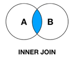
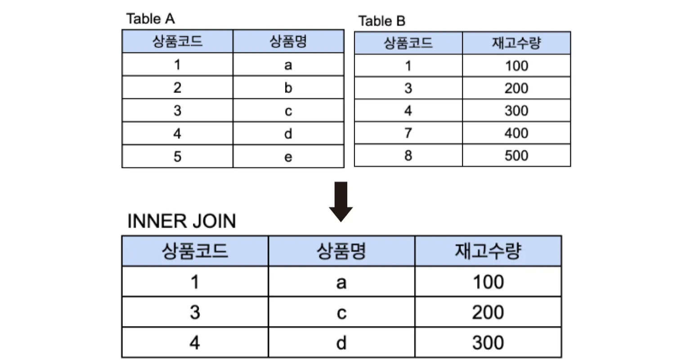
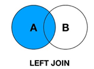
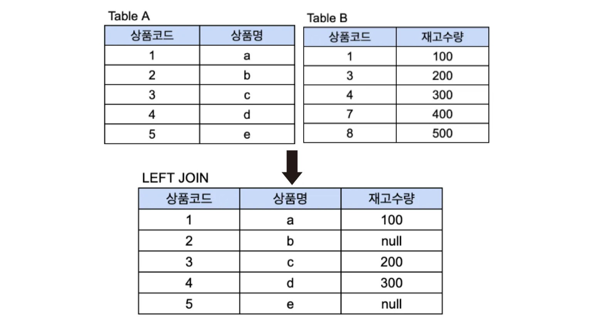
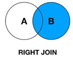
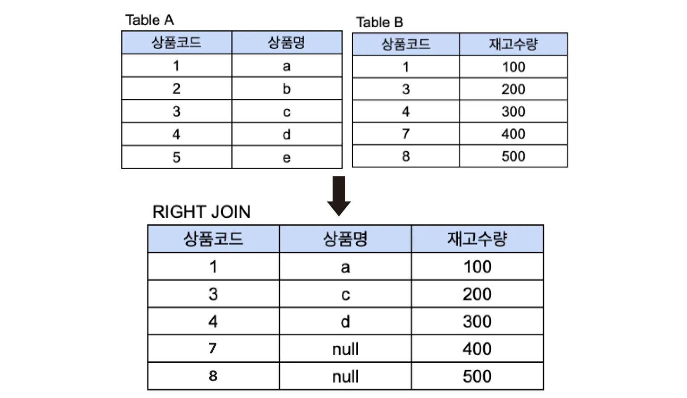
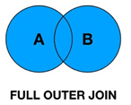
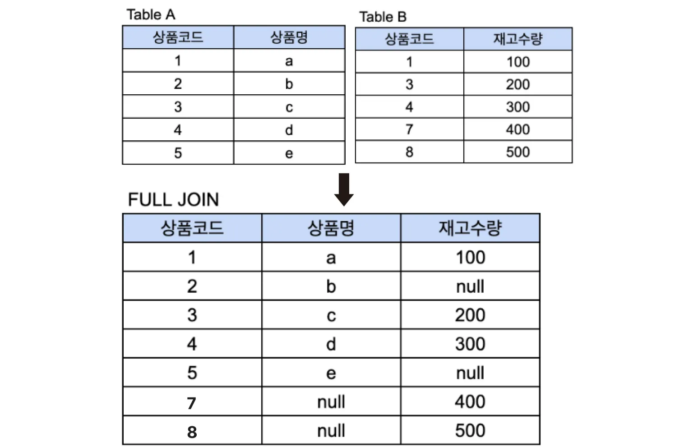

### 조인이 필요한 이유

데이터베이스에서는 데이터를 효율적으로 관리하기 위해 데이터를 여러 테이블에 나누어 저장한다. 하지만 특정 정보를 조회할 때 하나의 테이블만으로는 필요한 데이터를 모두 얻을 수 없는 경우가 많다. 이럴 때 여러 테이블을 연결하여 관련된 데이터를 조회하기 위해 조인을 사용한다. 

 >예시
    

    
>이 페이지에서 정보들을 한 화면에 보여주기 위해서는  `상품` 테이블의 정보(이름, 가격, 유효기간 등)와  `리뷰` 테이블의 해당 상품에 대한 리뷰 정보가 동시에 필요하다. 이 때 두 테이블을 조인하여 정보를 가져온다. 

<br> 
<br> 
조인은 크게 Inner Join, Outer Join으로 나뉜다. 

### inner join



교집합 연산과 유사한 연산이다. 하나로 합칠 두 테이블에서 공통된 값이 있는 행만 반환한다. 두 테이블 중 어느 한쪽이라도 null값을 가졌다면 결과에서 제외된다. 

```
//조회할 칼럼들
SELECT A.상품코드 상품코드, A.상품명 상품명, B.재고수량 재고수량
// 결합할 두 테이블 이름
FROM TableA as A
INNER JOIN TableB as B
// 결합 조건
on A.상품코드 = B.상품코드 
```




TableA와 TableB에서 상품코드 값이 같은(1,3,4) 데이터만 조회됨

<br>

### outer join

outer join은 하나로 합칠 두 테이블에서 공통 데이터 외에 어느 한 테이블에만 존재하는 데이터도 함께 출력하는 방법이다. 

데이터가 한 쪽에만 존재할 때 어느 테이블을 기준으로 삼을지에 따라 left outer join, right outer join, full outer join으로 나뉜다. 

#### left outer join

왼쪽 테이블을 기준으로 조인하는 방법



```
SELECT A.상품코드 상품코드, A.상품명 상품명, B.재고수량 재고수량

// FROM 절에 명시되는 테이블이 왼쪽 테이블
FROM TableA as A

// JOIN 뒤에 명시되는 테이블이 오른쪽 테이블
// 왼쪽 테이블을 기준으로 조인하겠다는 LEFT JOIN연산
LEFT JOIN TableB as B

on A.상품코드 = B.상품코드
```




기준 테이블인 TableA의 모든 상품코드가 결과에 포함되고, TableB에 일치하는 데이터가 없는 상품코드 2와 5의 경우, 재고수량이 null로 표시된다. 

<br>

#### right outer join

오른쪽 테이블을 기준으로 조인하는 방법



```
SELECT A.상품코드 상품코드, A.상품명 상품명, B.재고수량 재고수량 

// FROM 절에 명시되는 테이블이 왼쪽 테이블
FROM TableA as A 

// JOIN 뒤에 명시되는 테이블이 오른쪽 테이블
// 오른쪽 테이블을 기준으로 조인하겠다는 RIGHT JOIN연산   
RIGHT JOIN TableB as B   
ON A.상품코드 = B.상품코드
```



기준 테이블인 TableB의 모든 상품코드가 결과에 포함되고, TableA에 일치하는 데이터가 없는 상품코드 7와 8의 경우, 상품명이 null로 표시된다. 

<br>

#### full outer join

양쪽 테이블의 모든 데이터를 포함하는 방법



```
SELECT A.상품코드 상품코드, A.상품명 상품명, B.재고수량 재고수량 
FROM TableA as A       
FULL JOIN TableB as B   
ON A.상품코드 = B.상품코드
```



**상품코드 1, 3, 4** : 두 테이블에서 공통된 값으로, 상품명과 재고수량 모두 출력됨

**상품코드 2, 5** : Table A에만 있는 값으로, 재고수량이 NULL로 표시됨

**상품코드 7, 8** : Table B에만 있는 값으로, 상품명이 NULL로 표시됨

<br>


---

### 면접 질문

- SQL Join이 필요한 이유에 대해 말해보세요
- SQL Join의 종류에 대해 말해보세요
- 고객 정보 테이블과 고객ID값을 외래키로 갖는 주문 정보 테이블이 있습니다. 모든 고객의 주문정보를 가져오려고 할 때, 어떤 JOIN을 사용해서 구현할 것인지 말해주세요

### reference


