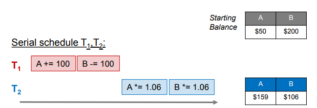
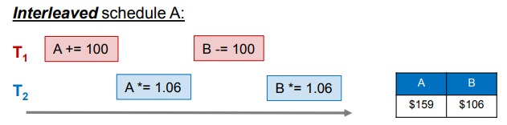
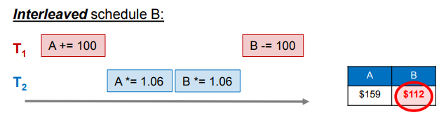
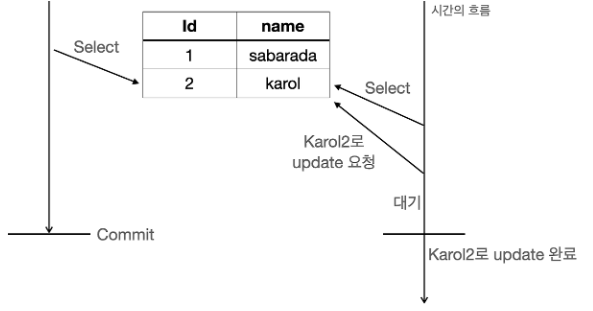
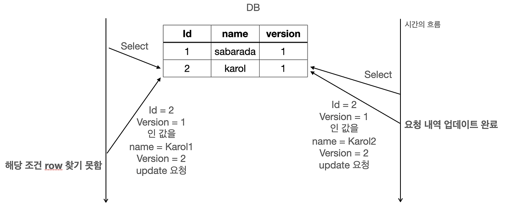
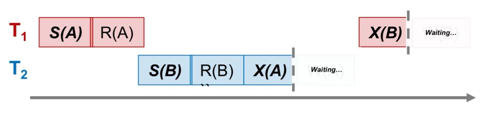

데이터베이스는 여러 사람이 **같은 데이터를 동시에 사용**할 수 있도록 만들어진 시스템이다. 

예를 들어, 온라인 쇼핑몰에서 많은 사람들이 동시에 상품 정보를 보고 주문을 넣는 상황에서, 데이터베이스는 한 사람이 상품을 조회하는 동안 다른 사람이 그 상품을 주문하거나 재고를 수정하는 작업을 처리한다. 

이런 동시 작업이 제대로 관리되지 않으면 데이터가 엉키거나 잘못된 정보가 저장되는 문제가 발생한다. 따라서 여러 작업이 동시에 일어나더라도 데이터베이스 내의 데이터가 항상 정확하고 일관되게 유지될 수 있도록 해야한다. 

<br>

### 트랜잭션 스케쥴 유형

트랜잭션 스케줄은 트랜잭션에 포함된 연산들이 실행되는 순서를 의미한다. 

**serial schedule 직렬스케쥴**

트랜잭션별로 순차적으로 실행하는 방식이다. 즉, 한 트랜잭션이 완전히 끝난 후에 다음 트랜잭션이 실행된다.  



모든 트랜잭션이 순차적으로 실행되어 데이터의 충돌이나 모순 없이 정확한 결과를 얻을 수 있다. 하지만 트랜잭션이 동시에 수행된다고 할 수 없다. 

**non-serial schedule 비직렬 스케쥴**

트랜잭션이 동시에 실행될 수 있는 스케줄이다. 



트랜잭션이 비직렬 스케줄에 따라 수행되면, 하나의 트랜잭션이 완료되기 전에 다른 트랜잭션의 연산이 실행될 수 있다.



하지만 직렬 스케쥴로 수행한 것과 결과가 다르게 나오기도 한다. T1이 B에서 100을 빼기 전에 T2가 B 값을 수정했기 때문에, 최종 결과가 불일치한다.  데이터의 일관성이 깨지고 예상과 다른 결과를 초래한다.

<br>

### Lock

트랜잭션이 동시에 실행되면서도, 데이터의 일관성을 보장하기 위해 데이터베이스는 Lock 메커니즘을 사용한다. Lock을 통해 각 트랜잭션이 데이터에 접근하는 동안 다른 트랜잭션은 대기 상태가 된다.

### lock이 이루어지는 과정

lock연산 : 트랜잭션이 사용할 데이터에 대한 독점권을 가짐

unlock연산 : 트랜잭션이 데이터에 대한 독점권을 반납하기 위해 사용

- **Lock 요청 :** 트랜잭션이 데이터를 읽거나 수정하기 위해, 필요한 데이터에 대해 락을 요청
- **DBMS 승인 :** 데이터베이스가 트랜잭션의 잠금 요청을 확인하고 허용한다
- **데이터 작업 :** 트랜잭션은 데이터를 읽거나 수정한다
- **Unlock :** 트랜잭션이 작업을 끝내면 잠금을 풀어 다른 트랜잭션이 접근할 수 있도록 한다
- **대기 중인 다른 트랜잭션 진행 :** 잠금이 풀리면 대기 중인 다른 트랜잭션이 작업을 이어서 진행한다

<br>

### Lock의 유형

1. **공유 잠금 Shared Lock (S-Lock)**
    
    데이터를 읽기`read` 전용으로 잠그는 방식
    
    여러 트랜잭션이 동시에 데이터를 읽는 것은 데이터에 영향을 주지 않으므로, 공유 잠금은 동시에 실행이 가능하다. 하지만 데이터를 수정하려는 작업은 잠금이 해제될 때까지 기다려야 한다. 
    
2. **독점 잠금 Exclusive Lock (X-Lock)**
    
    데이터를 쓰기`write` 전용으로 잠그는 방식
    
    데이터를 수정하는 동안 다른 트랜잭션의 읽기와 쓰기 모두 불가능하다. 
    
<br>

### Lock 관리 방식

1. **비관적 락 pessimistic lock**
    
    데이터 충돌이 자주 발생한다고 가정하고, 트랜잭션이 시작될 때부터 데이터를 잠그는 방식
    

    
- transaction A가 id2번의 데이터를 읽기 위해 해당 데이터에 대해 `S-lock(A)`를 설정
- transaction B가 같은 데이터를 읽기 위해  `S-lock(B)`를 설정
    - S-lock은 다른 트랜잭션이어도 동시에 수행 가능
- transation B가 해당 데이터를 수정하기 위해  `X-lock(B)` 요청하지만, 이미 `S-lock(A)`이 설정되어 있어 대기 상태로 전환
- transaction A가 작업을 마치고 `S-lock(A)`를 해제
- transaction B의 `X-lock(B)` 요청이 승인되고 데이터를 update

2. **낙관적 락 optimistic lock**
    
    데이터 충돌이 드물다고 가정하고, 트랜잭션이 데이터를 수정하기 전에 잠금 없이 작업한다. 대신, 최종 단계에서 충돌 여부를 확인하여 문제가 발생하면 기존 작업을 롤백(되돌림)하고 다시 시도한다.
    
    낙관적 락을 사용하는 데이터베이스는 각 데이터에 대해 버전번호를 저장하고 관리한다. 
    



- transaction A가 id 2번의 데이터를 읽는다. 버전 번호는 `1`로 기록되어 있다.
- transaction B가 같은 데이터를 읽는다. 버전 번호는 `1`로 기록되어 있음
- transation A가 데이터를 **Karol1**로 수정하고, 해당 데이터에 대한 버전번호가 `2`로 업데이트 된다.
- transaction B가 데이터를 `Karol2`로 수정하려고 시도한다.
    - 하지만, transaction B가 참조한 버전 번호 `1`이 `최신버전 2`와 다름을 확인. 충돌이 발생했으므로 transaction B의 수정 요청이 실패하고 작업이 **롤백**된다.
- transaction B는 작업을 다시 시도한다.
    - 이전 작업은 버려지고, **최신 데이터를 다시 읽어** 버전번호 `2` 를 참조해 작업을 시작한다.
    - transacion B는 이제 최신 데이터를 사용하므로, 충돌 없이 데이터를 수정할 수 있다. 데이터를 `Karol2`로 수정하고, 버전 번호는 3으로 업데이트 된다.
    - 데이터의 최종 상태
    
    ```jsx
    Id   Name       Version
    1    sabarada   1
    2    Karol2     3
    ```
    

<br>


### lock의 범위 설정

Lock연산을 통해 데이터를 잠그는 범위를 설정할 수 있다. 

- **행(row) 수준 Lock**
    - **가장 일반적**으로 사용되며, 데이터조작-DML(INSERT, UPDATE, DELETE) 작업에서 개별 행 단위로 Lock을 설정한다
- **테이블 수준 Lock**
    - 테이블 전체에 Lock을 설정한다
    - 주로 데이터 정의 -DDL 작업(`CREATE`, `ALTER`, `DROP`)에서 사용된다
- **데이터베이스 수준 Lock**
    - 데이터베이스 전체를 잠그는 방식으로, 하나의 트랜잭션만 데이터베이스에 접근 가능하다
    - 일반적으로 잘 사용되지 않지만, **DB 소프트웨어 업그레이드**나 **주요 업데이트 작업** 시에 사용된다
- **칼럼, 페이지/블록, 파일 기준 Lock**
    - 일부 DBMS에서 지원하지만, **거의 사용되지 않는 방식**입니다.

<br>

### lock의 문제점

1. **블로킹 blocking** 
    
    하나의 트랜잭션이 특정 데이터를 잠그고 작업을 수행하는 동안, **다른 트랜잭션은 이 데이터에 접근하지 못하고 대기**하는 상황을 말한다. 
    
    공유잠금끼리는 블로킹이 발생하지 않지만 독점잠금은 블로킹을 발생시킨다. (x-x, x-s)
    
    대기 상태가 길어지면 시스템의 성능 저하가 발생한다. 
    
    **[해결방안]**
    
    - **잠금 유지 시간이 짧게 해**, 다른 트랜잭션이 더 빨리 작업을 시작할 수 있도록 한다. → 트랜잭션의 길이를 줄이거나, SQL쿼리를 최적화하거나, 대용량 작업을 작은 단위로 나눈다.
    - 데이터베이스 설계를 개선해 **동일 데이터를 동시에 갱신하지 않도록 한다.**

1. **교착상태 Deadlock**
    
    **두 개 이상의 트랜잭션이 서로의 자원을 기다리며 무한 대기 상태**에 빠지는 상황을 말한다. 두 개의 트랜잭션이 각각 Lock을 설정하고, 다음 단계에서 서로가 Lock한 데이터에 접근하여 값을 얻어오려고 할 때 이미 각각의 트랜잭션에 의해 Lock이 설정되어 있기 때문에  양쪽 트랜잭션 모두 영원히 처리가 되지 않는 상태를 말한다. 
    
    
    
    - **T1**이 데이터 A를 읽기 위해 **S-Lock(A)**를 설정한 뒤 **R(A)** 작업을 수행
    - **T2**는 데이터 B를 읽기 위해 **S-Lock(B)**를 설정하고 **R(B)** 작업을 수행
    - **T2**가 데이터 A를 수정하려고 **X-Lock(A)**를 요청하지만, 이미 T1이 **S-Lock(A)**를 가지고 있어 대기상태로 blocking됨
    - 반대로, T1도 데이터 B를 수정하려고  **X-Lock(B)**를 요청하지만, T2가 **S-Lock(B)**를 가지고 있어 **대기 상태**로 blocking됨
    - 두 트랜잭션이 서로의 락 해제를 기다리며 **무한 대기 상태**로 빠짐
    
    **[해결방안]**
    
    - 자원 요청 순서를 일관되게 정의해 **순환 대기를 방지한다**
    - 트랜잭션이 일정 시간 동안 락을 얻지 못하면 자동으로 실패(롤백)하는 **타임아웃을 사용해** 무한 대기를 방지한다
    - DBMS가 Deadlock 상태를 주기적으로 탐지해 관련 트랜잭션 중 하나를 종료한다

---

### 예상질문

- DB lock메커니즘이 무엇이고, lock의 유형 두가지에 대해 설명해주세요.
- 락 관리 방식 중 Optimistic Lock과 Pessimistic Lock에 대해 설명해주세요.
- lock을 사용했을 때 발생할 수 있는 문제점과 그 해결방안에 대해 설명해주세요.

### References

[비관적,낙관적 락](https://sabarada.tistory.com/175)
