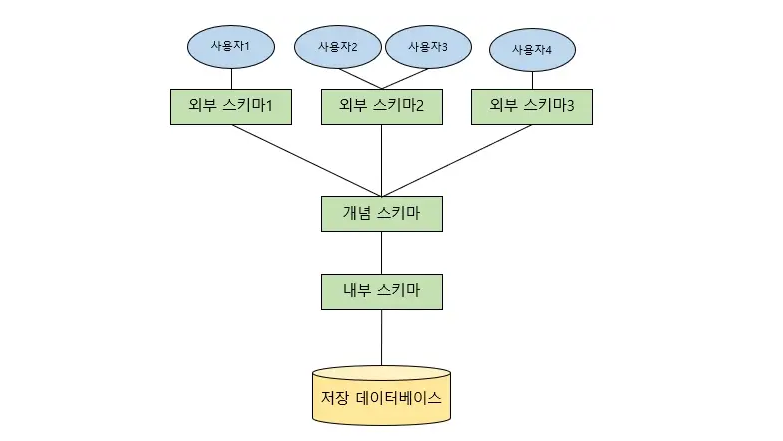
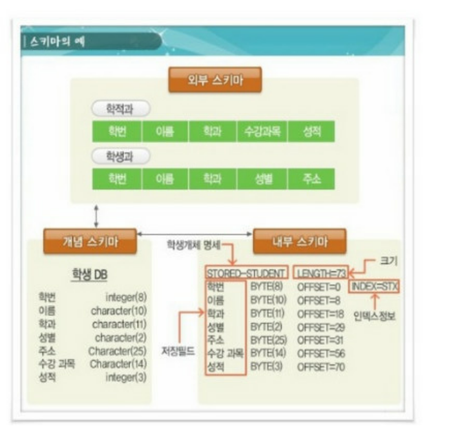

# 데이터 베이스 Schema

## Schema 정의

> 데이터 베이스의 구조와 제약 조건에 관한 전반적인 **명세**를 기술한 것

⇒ 어떤 구조로 데이터가 DataBase내에 저장이 되는가를 나타내는 DataBase 구조를 의미한다.

- DB를 구성하는 데이터 객체(Entity), 속성(Attribute), 관계(Relationship) 및 데이터 조작 시 데이터 값들이 갖는 제약조건 등에 관해 전반적으로 정의한다.
- 객체의 특성을 나타내는 속성(Attribute)과, 속성들의 집합으로 이루어진 객체(Entity), 객체 사이에 존재하는 관계(Relationship)에 대한 정의 및 이들이 유지해야할 제약 조건들을 기술한 것이다.

→ 사용자의 관점에 따라 외부 스키마, 개념 스키마, 내부 스키마로 나누어진다.

## Schema 종류

### 외부 스키마 = 사용자 뷰 (View)

: 사용자나 프로그래머가 각 개인의 입장에서 필요로하는 DataBase의 논리적 구조를 정의한 것

⇒ 실재하는 데이터들을 어떤 형식, 구조, 배치 화면을 통해 사용자들에게 보여줄 지 정의한다.

**특징**

- 하나의 DB시스템에는 여러 개의 외부 스키마가 존재할 수 있고, 하나의 외부 스키마를 여러 개의 응용 프로그램이나 사용자가 공유할 수도 있다
- 같은 DB에 대해서도 서로 다른 관점을 정의할 수 있도록 허용한다
- 일반 사용자는 SQL을 이용하여 DB를 사용한다
- 프로그래머는 C, JAVA등의 언어를 사용하여 DB에 접근한다

### 개념 스키마 (Conceptional Schema) = 전체적인 뷰 (View)

> 조직체 전체를 관장하는 입장에서 DateBase를 정의한 것
> → DataBase의 전체적인 논리적 구조

⇒ 따라서 조직의 모든 응용시스템에서 필요로 하는 객체 관계, 제약 조건들을 포함하고 있다

**특징**

- 모든 응용프로그램이나 사용자들이 필요로하는 데이터를 종합한 조직 전체의 DataBase
- DBA(데이터 베이스 관리자)에 의해 구성되며, DataBase당 하나만 존재한다

### 내부 스키마

> 물리적 저장 장치의 입장에서 본 DataBase의 구조
> DataBase의 물리적 저장 구조를 정의한 것

- 구체적으로 개념 스키마를 디스크 기억 장치에 물리적으로 구현하기 위한 방법을 기술한 것
- 실제로 DataBase에 저장될 레코드의 물리적인 구조를 정의하고, 저장 데이터 항목의 표현방법, 내부 레코드의 물리적 순서 등을 나타낸다
- 시스템 프로그래머나 시스템 설계자가 보는 관점의 스키마

## 이해를 돕기 위한 사진

## GPT가 대답해준 내부 스키마 예시

### 내부 스키마의 구현 예시

개념 스키마를 내부 스키마로 구체화하여, 데이터베이스 내부에서 물리적으로 어떻게 저장할 수 있을지 살펴보겠습니다.

- **파일 분할 및 저장 방식**
  - 데이터베이스는 데이터를 물리적 파일로 나누어 저장합니다.예를 들어, 학생 정보를 저장하는 파일은 `Student.dat`, 강의 정보를 저장하는 파일은 `Course.dat` 같은 형태로 구성될 수 있습니다.
- **인덱스 구성**
  - 빠른 검색을 위해 `학생 정보`에서 `학번`을 기준으로 인덱스를 생성할 수 있습니다.이를 통해 학번으로 학생을 검색할 때 빠르게 찾아낼 수 있습니다.
  - 또한 `수강 정보`에서도 `학번`과 `강의명`을 인덱스로 생성하여, 특정 학생이 어떤 강의를 듣는지 또는 특정 강의를 수강하는 학생을 쉽게 찾을 수 있습니다.
- **저장 블록 및 압축**
  - 물리적 저장 공간을 효율적으로 사용하기 위해 데이터를 블록 단위로 나눕니다. 예를 들어, `Student.dat` 파일의 데이터는 4KB씩 나누어 디스크에 저장됩니다.
  - 데이터의 크기를 줄이기 위해 자주 등장하는 값(예: ‘전공’에 “컴퓨터공학”과 같은 반복되는 값)을 압축하여 저장할 수도 있습니다.
- **저장소 파티셔닝**
  - 수강 인원이 많은 강의와 적은 강의를 구분하여 별도의 파티션에 저장할 수 있습니다.예를 들어, 학생 수가 많은 강의는 빠르게 접근이 필요한 경우 고속 SSD에 저장하고, 학생 수가 적은 강의는 속도보다 비용 효율을 고려해 하드디스크에 저장할 수 있습니다.

## 예상 면접 질문

1. 스키마의 종류 및 어떤 기준으로 나누었는 지
2. 각 스키마들의 특징이 무엇이 있는 지
3. 내부 스키마의 구현 예시에 대해 간략한 설명

### 출처

https://velog.io/@msung99/%EB%8D%B0%EC%9D%B4%ED%84%B0%EB%B2%A0%EC%9D%B4%EC%8A%A4%EC%99%80-%EC%8A%A4%ED%82%A4%EB%A7%88Schema

https://gunjoon.tistory.com/73
