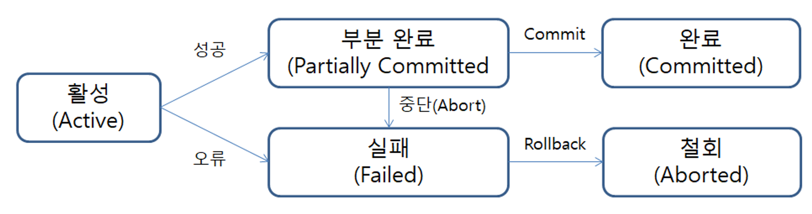
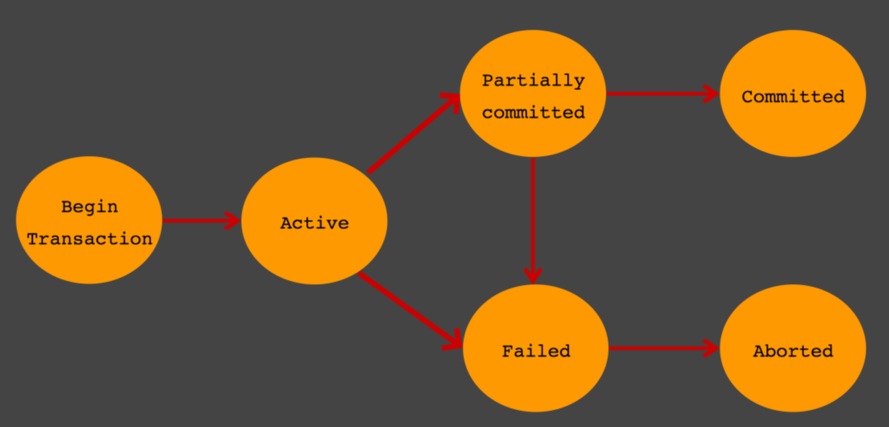

# 트랜잭션

## 정의

: DB의 상태를 변경시키는 작업의 단위

→ 한꺼번에 수행되어야 할 연산을 모아놓은 것, 연산들을 모두 처리하지 못 한 경우에는 원 상태로 복구한다. 즉 작업의 일부만 적용되는 현상이 발생하지 않는다.

## 트랜잭션의 4가지 특징 : ACID

1. Atomicity (원자성)
   트랜잭션이 DB에 모두 반영되거나, 전혀 반영되지 않아야한다.
2. Consistenty (일관성)
   트랜잭션의 작업 처리 결과는 항상 일관성이 있어야 한다.
   시스템이 가지고 있는 고정 요소는 트랜잭션 수행 전과 수행 후의 상태가 같아야 한다,
   DB의 제약조건을 위배하는 작업을 트랜잭션 과정에서 수행할 수 없다.
   ex) 송금 시 금액의 데이터 타입을 정수형(integer)에서 문자열(string)로 변경할 수 없음
3. Isolation (독립성)
   둘 이상의 트랜잭션이 동시에 병행 실행되고 있을 때, 어떤 트랜잭션도 다른 트랜잭션의 연산에 끼어들 수 없다.
4. Durability (지속성)
   트랜잭션이 성공적으로 완료되었으면, 결과는 영구적으로 반영되어야 한다.

## 트랜잭션의 연산

### (1) Commit 연산

**트랜잭션이 성공적으로 수행되었음을 선언하는 연산**

`COMMIT` 연산의 실행을 통해 트랜잭션의 수행이 성공적으로 완료되었음을 선언하고, 그 결과를 최종 DB에 반영

### (2) RollBack 연산

**트랜잭션의 수행이 실패했음을 선언하고 작업을 취소하는 연산**

트랜잭션이 수행되는 도중 일부 연산이 처리되지 못한 상황이라면 `ROLLBACK`연산을 실행하여 트랜잭션 수행이 실패했음을 선언하고, DB를 트랜잭션 수행 전과 일관된 상태로 되돌린다

## 트랜잭션의 상태

- Active
  <트랜잭션 활동 상태>
  트랜잭션이 실행 중이며 동작 중인 상태를 말한다
- Partially Committed
  <트랜잭션의 `COMMIT` 명령이 도착한 상태>
  트랜잭션의 COMMIT 이전 SQL문이 수행되고, COMMIT만 남은 상태를 말한다
- Failed
  <트랜잭션 실패 상태>
  더 이상 트랜잭션이 정상적으로 진행될 수 없는 상태를 말한다
- Committed
  <트랜잭션 완료 상태>
  트랜잭션이 정상적으로 완료된 상태를 말한다
- Aborted
  <트랜잭션 취소 상태>
  트랜잭션이 취소되고, 트랜잭션 실행 이전 데이터로 돌아간 상태를 말한다

<aside>

**Partially Committed** vs **Committed**

`COMMIT` 요청이 들어오면, Partially Commited 상태가 된다

이후 `COMMIT`을 문제없이 수행할 수 있으면 Committed 상태로 전이되고, 오류가 발생하면 Failed상태가 된다

즉, Partially Committed는 `COMMIT` 요청이 들어왔을 때를 말하며,
Committed는 `COMMIT`을 정상적으로 완료한 상태를 말한다

</aside>

## 트랜잭션 사용 시 주의할 점

트랜잭션은 꼭 필요한 최소한의 코드에만 적용하는 것이 좋다 → 트랜잭션의 범위를 최소화 해라

일반적으로 DB 커넥션의 개수가 제한적이다. 그런데 각 단위 프로그램이 커넥션을 소유하는 시간이 길어지면, 사용가능한 여유 커넥션의 개수는 줄어들게 된다. 그러다 어느 순간에는 각 단위 프로그램에서 커넥션을 가져가기 위해 기다려야 하는 상황이 발생할 수 있기 때문이다.

## **트랜잭션의 예 (From. GPT)**

은행 계좌 간의 송금 작업을 예로 들어보겠습니다.

### **시나리오**

사용자 A가 사용자 B에게 100,000원을 송금하려고 합니다. 이 과정은 다음과 같은 단계로 나뉩니다:

1. 사용자 A의 계좌에서 100,000원을 차감.
2. 사용자 B의 계좌에 100,000원을 입금.

이 작업이 트랜잭션으로 처리되지 않으면, 다음 문제가 발생할 수 있습니다:

- 1번 작업이 완료되고, 2번 작업이 실패하면 A의 돈만 차감되고 B는 돈을 받지 못함.
- 또는 두 작업이 실행 중 다른 트랜잭션과 충돌하여 데이터베이스가 일관성을 잃음.

## 병행제어 (Concurrency Control)

여러 개의 트랜잭션이 실행될 때, 트랜잭션들이 DB의 일관성을 파괴하지 않고 다른 트랜잭션에 영향을 주지 않으면서, 트랜잭션을 제어하는 것

### 병행 실행 시 발생 가능한 문제들

1. 분실된 갱신
   두 개의 트랜잭션이 같은 데이터에 대해서 동시에 갱신 작업을 하면 , 하나의 갱신 작업이 분실 되는 경우
2. 모순성
   한 개의 트랜잭션 작업이 갱신 작업을 하고 있는 상태에서 또 하나의 트랜잭션이 같은 작업 구역에 침범하여 작업하게 되어, DB의 일관성을 해치는 경우
3. 연쇄복귀
   같은 자원을 사용하는 두 개의 트랜잭션 중 한 개의 트랜잭션이 성공적으로 작업을 수행했다 하더라도 다른 트랜잭션이 처리하는 과정에서 실패하게 되면, 두 트랜잭션 모두가 복귀가 되는 현상
4. 비완료 의존성
   한 개의 트랜잭션이 수행 과정에서 실패하였을 때, 이 트랜잭션이 회복되기 전에 다른 트랜잭션이 수행결과를 참조하는 현상

- 사례 (From. GPT)
  ### **각 병행 실행 문제와 사례**
  1. **분실된 갱신 (Lost Update)**:
     - 두 트랜잭션이 동시에 데이터를 갱신하면, 하나의 트랜잭션 결과가 덮어쓰여 손실.
     - **예**:
       - 트랜잭션 T1: 재고 수량 10개 → 8개로 수정.
       - 트랜잭션 T2: 재고 수량 10개 → 9개로 수정.
       - 최종 재고 수량이 8개 또는 9개로 저장돼 원래 결과(7개)가 손실.
  2. **모순성 (Inconsistency)**:
     - 트랜잭션이 데이터 갱신 중 다른 트랜잭션이 데이터에 접근해 잘못된 결과를 초래.
     - **예**:
       - T1이 제품 가격을 100,000원에서 90,000원으로 변경 중.
       - T2가 같은 제품의 할인율 계산 작업을 수행하여 잘못된 할인율을 저장.
  3. **연쇄 복귀 (Cascading Rollback)**:
     - 한 트랜잭션의 실패로 인해 의존 관계에 있는 다른 트랜잭션이 모두 Rollback.
     - **예**:
       - T1: A 계좌에서 B 계좌로 송금 (100,000원 차감).
       - T2: B 계좌에서 C 계좌로 송금 (100,000원 추가).
       - T1이 실패하면 T2도 취소되어 모든 작업이 무효화.
  4. **비완료 의존성 (Uncommitted Dependency)**:
     - 미완료 트랜잭션의 데이터를 다른 트랜잭션이 참조하여 잘못된 작업을 수행.
     - **예**:
       - T1이 A의 계좌 잔액을 100,000원 → 200,000원으로 변경 중 (미완료).
       - T2가 A의 잔액을 참조해 송금을 진행.

### 병행제어 기법

1. 락킹 (Locking)
   1. 공유 락 (Shared Lock) : 데이터를 읽는 동안 다른 트랜잭션이 데이터를 수정하지 못하도록 함
   2. 배타 락 (Exclusive Lock) : 데이터를 수정하는 동안 다른 트랜잭션이 데이터를 읽거나 수정하지 못하도록 함
   3. 문제점 : 데드락(DeadLock), 교착 상태 발생 가능
2. 낙관적 병행 제어 (Optimistic Concurrency Control)
   1. 트랜잭션 동안 데이터에 락을 걸지 않고, 커밋 단계에서 충돌 여부를 검사
   2. 적용 상황 : 읽기 작업이 많은 환경
3. 타임 스탬프 기법 (TimeStamp Ordering)
   1. 트랜잭션마다 타임스탬프를 부여하고, 타임스탬프 순서대로 작업을 처리
   2. 장점 : DeadLock 회피
   3. 단점 : 타임스탬프 관리의 복잡성
4. 다중 버전 병행제어 (MVCC, Multi-Version Concurrency Control)
   1. 각 트랜잭션이 동일 데이터의 스냅샷을 사용하여 충돌 없이 동시성 관리
      → 스냅샷 (snapshot) : 데이터베이스의 특정 시점에서의 데이터 상태를 복사한 것을 의미, 트랜잭션간의 독립성을 유지
   2. 사용 사례 : PrstgreSQL, MySQL(InnoDB)

## 트랜잭션의 격리 수준 (Isolation Level)

ACID 중 Isolation(독립성, 고립성)을 구현하는 개념으로,
동시에 여러 트랜잭션이 처리될 때 트랜잭션끼리 얼마나 서로 고립되어 있는 지를 나타내는 것

| **격리 수준**        | **특징**                                                           | **발생 가능한 문제**                          |
| -------------------- | ------------------------------------------------------------------ | --------------------------------------------- |
| **Read Uncommitted** | 다른 트랜잭션이 커밋하지 않은 데이터를 읽을 수 있음.               | Dirty Read, Non-Repeatable Read, Phantom Read |
| **Read Committed**   | 커밋된 데이터만 읽을 수 있음.                                      | Non-Repeatable Read, Phantom Read             |
| **Repeatable Read**  | 같은 트랜잭션 내에서 같은 데이터를 읽으면 항상 동일한 값을 반환.   | Phantom Read                                  |
| **Serializable**     | 트랜잭션이 직렬적으로 실행된 것처럼 동작하여 완벽한 일관성을 보장. | 없음 (하지만 성능 저하)                       |

아래로 내려갈 수록 트랜잭션 간

고립 정도는 높아지나 성능은 떨어짐

## 레퍼런스

https://velog.io/@shasha/Database-%ED%8A%B8%EB%9E%9C%EC%9E%AD%EC%85%98-%EC%A0%95%EB%A6%AC

## 예상 면접 질문

1. 트랜잭션의 특징 4가지
2. 트랜잭션의 과정
3. 트랜잭션 병행 제어 방법에 대해 간략히 설명
