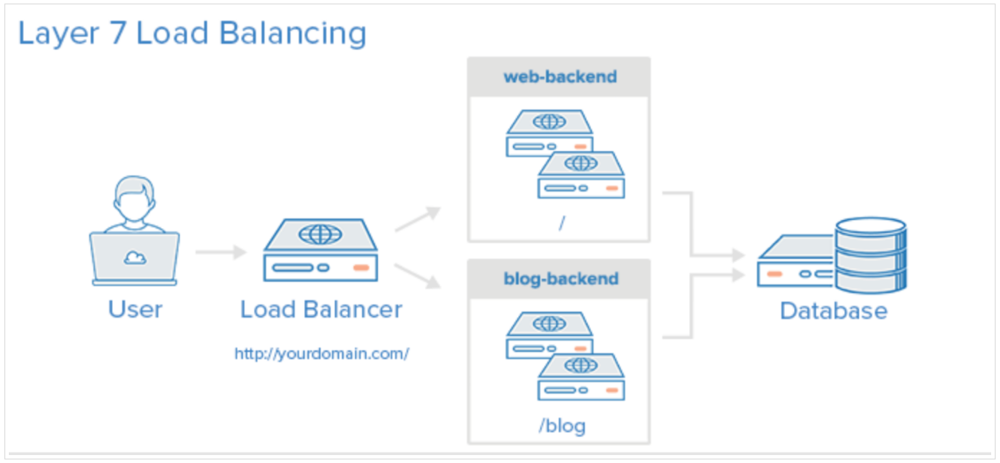
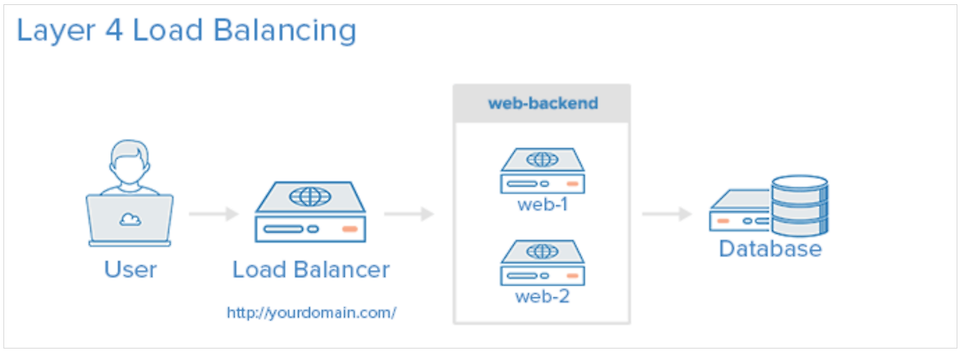

## 네트워크를 이루는 장치

네트워크 기기는 계층별로 처리 범위를 나눌 수 있다. 

- 애플리케이션 계층 : L7스위치
- 전송 계층 : L4스위치
- 네트워크 계층 :  L3스위치, 라우터
- 데이터 링크 계층 : L2스위치, 브리지
- 물리 계층 : NIC, 리피터, AP

상위 계층을 처리하는 기기는 하위 계층의 프로토콜을 처리할 수 있지만, 그 반대는 불가

- ex> L7스위치는 애플리케이션 계층을 처리하는 기기로, 그 밑의 모든 계층의 프로토콜을 처리할 수 있다. 하지만 AP는 물리 계층만 처리할 수 있다. 

<br>


### 스위치

 같은 네트워크 안의 장치들을 MAC 주소로 연결하고 관리하는 장치

주로 LAN에서 사용됨 ⇒ 각 장치(컴퓨터, 프린터 등) 고유의 MAC주소를 기반으로 데이터를 전달

- ex>사무실이나 가정 내에서 컴퓨터나 프린터 등 여러 장치를 네트워크로 연결할 때 사용

> 연결장치들이 보낸 데이터를 받아, 
목적지 MAC주소를 보고 
정확한 장치로 데이터를 전달
> 

네트워크 트래픽을 관리하여 충돌을 줄이고 효율적인 데이터 전송을 가능하게 함

### 라우터

서로 다른 네트워크 간에 데이터를 전달하고, 네트워크 간 연결을 관리하는 장치

주로 인터넷 연결을 위해 사용됨 ⇒ IP주소를 기반으로 데이터를 목적지 네트워크로 전송

- ex> 집이나 회사에서 인터넷을 사용할 때, 라우터는 인터넷 서비스 제공자(ISP)의 네트워크와 내부 네트워크(LAN)를 연결

> IP주소를 사용하여 데이터 패킷을 분석하고,
최적의 경로를 선택해 다음 네트워크로 데이터를 전송
> 

### 로드밸런서

서버에 전달되는 요청을 분산시켜 여러 서버가 트래픽을 나눠 처리하도록 하는 장치

> 사용자가 요청을 보내면, 
여러 서버 중에서 가장 적합한 서버로 요청을 분배
> 

한 서버에 과도한 요청이 집중되지 않고, 서비스가 안정적으로 제공되도록 함

- ex> 대규모 웹사이트나 클라우드 서비스에서, 수많은 사용자 요청을 여러 서버에 나눠 처리하여 시스템 성능을 최적화


<br>


```
L3, L4, L7 스위치는 각각 네트워크, 전송, 애플리케이션 계층에서 트래픽을 처리하고 분배한다. 

로드밸런서나 라우터의 기능을 수행하지만, 
“데이터 패킷을 전달하는 기능”이라는 스위치의 기본 개념을 확장해서 
더 높은 계층의 정보를 분석하고 처리할 수 있게 만들었기 때문에, 

“스위치”라는 이름을 유지한다. 
```


<br>


## [애플리케이션 계층 처리 기기] L7스위치

> **로드밸런서** : 클라이언트로부터 오는 요청을 여러 서버로 분산하여 서버 부하를 고르게 분배
> 

애플리케이션 계층의 정보를 기반으로 데이터를 처리

- HTTP요청, URL, 쿠키, 세션 정보 같은 애플리케이션 수준의 데이터를 분석하여 트래픽을 처리
- 웹 서버에 요청이 들어오면 요청의 내용(예: 특정 URL, 사용자 세션 등)을 분석하여 가장 적합한 서버로 트래픽을 분배

보안 및 필터링 기능

- 불필요한 외부 데이터, 악의적인 요청, 또는 보안 위협을 탐지하고 차단

서버 클러스터링 및 가상 IP 제공

- 두 개 이상의 서버를 클러스터로 구성하고 하나의 가상 IP주소를 제공하여 서버 그룹을 형성
- 여러 서버가 마치 하나의 서버처럼 동작하는 것처럼 보이게 만듦
- 클러스터 내 하나의 서버가 고장나더라도,  서비스 중단 방지

주기적 헬스체크 기능

- 설정된 전송주기와 재전송 횟수를 바탕으로 서버에 요청을 보내고, 해당 서버가 정상적으로 작동하는지 확인
- 요청은 TCP, HTTP 등의 프로토콜 이용
    - TCP헬스체크 ⇒ 서버와의 연결이 가능한지 확인
    - HTTP헬스체크 ⇒ 서버가 HTTP요청에 대해 올바른 응답을 반환하는지 확인
- 서버에 장애가 발생하여 응답이 없거나 비정상적인 상태일 경우, L7스위치는 그 서버를 트래픽 분산 대상에서 제외


<br>


## [전송 계층 처리 기기] L4스위치

> **로드밸런서** : 클라이언트로부터 오는 요청을 여러 서버로 분산하여 서버 부하를 고르게 분배
> 

전송계층의 정보를 기반으로 데이터를 처리

- IP 주소와 포트 번호를 기반으로 트래픽을 분배

세션 기반 분배

- 세션을 기반으로 트래픽을 관리
- 클라이언트가 서버와 연결된 세션이 있을 경우, 동일한 세션의 요청은 동일한 서버로 전달
- 세션이 유지되는 동안, 요청이 같은 서버로 계속 전달되어 연결의 일관성 유지

프로토콜 독립적

- 애플리케이션 계층(전송계층보다 상위)의 데이터를 분석하지 않음
- 프로토콜에 관계없이 트래픽을 분배

|  | L7 | L4 |
| --- | --- | --- |
| 분석계층 | 애플리케이션 계층(7계층) | 전송 계층(4계층) |
| 분석 데이터 | HTTP 요청, URL, 쿠키 등 애플리케이션 데이터 | IP 주소 및 포트 번호 |
| 처리속도 | 복잡한 데이터 분석 ⇒ 느림 | 빠름 |
| 트래픽 제어 수준 | 세밀한 제어 | 단순한 제어 |
| 사용 예시 | 웹서비스, API게이트웨이, CDN 애플리케이션 레벨의 로드밸런싱이 필요한 서비스 | 온라인 게임, 스트리밍 서비스 등 실시간 트래픽 처리가 중요한 서비스 |






<br>


## [네트워크 계층 처리 기기] L3스위치

> **스위치 + 라우터** : 같은 네트워크 내 MAC주소 기반 데이터 전송 + 다른 네트워크 간 IP주소 기반 데이터 전송
> 

IP라우팅

- 패킷에 포함된 **출발지 IP와 목적지 IP**를 바탕으로, **라우팅 테이블**을 참조하여 **최적 경로**를 선택해 패킷을 전송
    - 라우팅 테이블 : 각 네트워크로 가는 경로 정보(IP 주소, 서브넷 마스크, 다음 홉)가 저장된 데이터 구조
    - 최적 경로 : 네트워크 비용(대역폭, 지연 시간)과 홉 수(패킷이 거치는 중간 장치의 수)를 기준으로 결정

VLAN(가상LAN) 간 통신 지원

- 서로 다른 VLAN 간 통신을 IP 라우팅을 통해 처리 가능

```
VLAN : 
물리적으로 같은 네트워크에 연결된 장치들을 
논리적으로 여러 개의 작은 네트워크로 나누는 기술

ex> 한 회사 내의 네트워크에서 부서별로 네트워크를 분리할 때 VLAN을 사용
기본적으로 서로 다른 VLAN 간에는 통신이 되지 않음
```

하드웨어 기반 라우팅

- 전용 칩을 사용해 라우팅 작업
- 트래픽을 매우 안정적이고 빠르게 처리
- 대규모 네트워크에서 고성능이 필요한 경우 적합


<br>


## [데이터 링크 계층 처리 기기] L2스위치

> **스위치** : 같은 네트워크 간 데이터 전송
> 

MAC 주소 기반 데이터 전송

- 패킷의 목적지 MAC주소를 확인해  네트워크 내에서 데이터를 전달

플러딩, 포워딩, 필터링

- 플러딩 (flooding) : 목적지 MAC주소를 모르는 경우, 패킷을 네트워크에 연결된 모든 장치로 전송
- 포워딩 (forwarding)  : 목적지 MAC주소를 아는 경우, 해당 장치로만 데이터를 전달
- 필터링 (filtering)  : 패킷이 전송될 필요가 없는 경우, 그 패킷을 차단하여 불필요한 트래픽을 줄임


<br>


## [데이터 링크 계층 처리 기기] 브리지

네트워크 세그먼트(구간) 연결

- 두 개 이상의 LAN을 물리적으로 연결하여, 하나의 네트워크처러 통합
- 각 세그먼트는 여전히 독립적이지만, 서로 데이터를 주고받을 수 있는 상태
- 네트워크 범위가 확장됨

데이터 전달 과정
  ```
프레임 수신 : 
 네트워크의 한 쪽 세그먼트에서 장치가 데이터를 보냄
 그 프레임이 브리지로 들어옴
 브리지가 해당 프레임의 발신자 MAC주소를 확인하고, 이를 MAC주소 테이블에 기록

목적지 확인 : 
브리지는 프레임에 들어있는 수신자 MAC주소를 확인
그 주소가 자신이 관리하는 MAC 주소 테이블에 있는지 찾음

프레임 전달 : 
수신자 MAC주소가 자신의 MAC주소 테이블에 있다면, 브리지는 프레임을 전달하지 않음
수신자 MAC주소가 자신의 MAC주소 테이블에 없다면(다른 세그먼트에 연결된 장치라면), 브리지는 해당 세그먼트로 프레임을 전달
```

 - 서로 다른 세그먼트에 있는 장치들이 필요한 경우에만 통신하게 되어, 네트워크 범위는 확장되지만 트래픽 혼잡을 방지


<br>


|  | 브리지 | L2스위치 |
| --- | --- | --- |
|  동작 방식 | 소프트웨어 기반 동작 | 하드웨어 기반 동작 |
| 포트 수 | 적은 포트 | 많은 포트 |
| MAC주소 테이블 | 작은 MAC주소 테이블 | 큰 MAC주소 테이블 |
| 네트워크 규모 | 소규모 네트워크 | 대규모 네트워크 |


<br>


## [물리 계층 처리 기기]

### 허브 (Hub)

OSI 1계층에서 작동

- L1 기능만 수행
- 데이터를 단순히 전기 신호로 전송하는 역할

지능적인 장비가 아니기 때문에, **모든 연결된 장치로 데이터를 전송**

- 과도한 트래픽, 네트워크 상의 충돌 발생 가능
- 오늘날에는 L2스위치로 대부분 대체됨

<br>

### 리피터 (Repeater)

네트워크에서 일정 거리를 넘어가면 신호가 약해지는데, 리피터는 이 신호를 받아 **증폭**하고 재전송

신호를 더 멀리까지 전송 가능 (네트워크의 범위를 확장)

<br>


### AP (Access Point)

유선네트워크와 무선네트워크 연결하는 장치

```유선 네트워크 연결 : 
AP는 이더넷 케이블을 통해 유선 네트워크(예: 라우터나 스위치)에 물리적으로 연결됨

무선 신호 송출 : 
AP는 연결된 유선 네트워크를 통해 받은 네트워크 트래픽을 wifi신호로 변환하여 주변에 무선 신호를 송출

무선 장치 접속 : 
무선 장치들은 이 신호를 통해 AP에 접속, 유선 네트워크에 연결된 인터넷이나 내부 네트워크 리소스에 접근

데이터 송수신 : 
- 무선 장치에서 인터넷 페이지를 요청하거나 데이터를 보냄
AP가 이를 받아 유선 네트워크로 전달
- 유선 네트워크로부터 받은 데이터를 무선 장치로 다시 송신 
```


<br>


## 예상 면접 질문

- OSI 7계층 모델에서 각 계층별로 처리하는 네트워크 기기에 대해 설명해보세요
- L2스위치와 L3스위치의 차이점은 무엇인가요
- 라우터와 스위치의 차이점은 무엇인가요


<br>


## 참고자료

[네트워크장비, 허브, 스위치, 라우터](https://yys630.tistory.com/27)

[네트워크, L4, L7 로드밸런싱](https://jiwondev.tistory.com/189)

[스위치 (L1, L2, L3, L4, L7)](https://blog.naver.com/bizblocklll/222152306690)