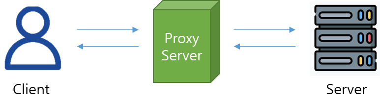
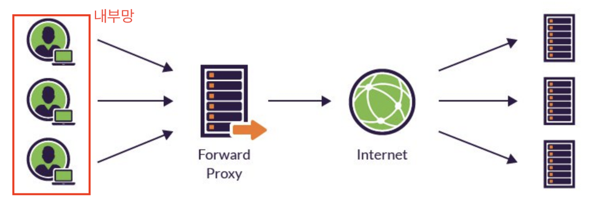
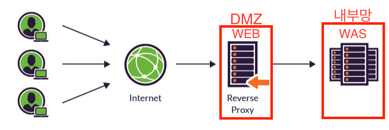

## 프록시 서버

- proxy의 뜻은 “대리”, “대신”으로 프록시 서버란 서버-클라이언트 간 통신을 할 때, 서버와 클라이언트가 직접 통신하지 않고 중간에서 대리로 통신하는 것을 말함
- 즉, **클라이언트-서버 사이의 중계 서버**로써 중간에 위치하여, ****클라이언트는 프록시 서버를 “서버”라고 인식하고, 서버는 프록시 서버를 “클라이언트”라고 인식하게 됨.
- 네트워크에서 다른 서버로의 자원 요청을 중계하며 분산 시스템 구조를 단순화 하여 **서비스의 복잡도를 줄일 수 있음**




## 동작원리

클라이언트가 서버로부터 필요한 파일, 웹 페이지 등과 같은 자원을 프록시서버에 요청하면 프록시 서버는 클라이언트와 서버 사이에서 대신 통신을 수행한다.

1. 클라이언트에서 프록시 서버로 데이터 전송
2. 프록시 서버에서 다시 웹서버로 웹 요청
3. 웹 서버에서 프록시 서버로 웹 응답
4. 프록시 서버에서 클라이언트로 데이터 전송 


## 사용목적

1. **보안 강화 및 익명성 유지**
- **IP 숨기기**: 프록시 서버는 사용자의 IP 주소를 숨기고, 대신 프록시 서버의 IP로 외부 서버에 접속하게 함. 이를 통해 사용자의 위치나 신분을 보호할 수 있습니다.
- **방화벽 및 액세스 제어**: 기업에서는 프록시 서버를 사용해 외부 웹사이트에 대한 접근을 제한하거나 내부 시스템에 대한 외부 접근을 제어할 수 있음
2. **캐싱을 통한 성능 향상**
- **데이터 캐싱**: 자주 요청되는 웹 페이지나 리소스를 프록시 서버에 저장(캐싱)하여, 동일한 요청이 있을 때 원본 서버에 재요청하지 않고 프록시 서버에서 빠르게 제공할 수 있음. 이를 통해 네트워크 대역폭을 절감하고 응답 속도를 향상시킬 수 있음
3. **콘텐츠 필터링**
- 특정 웹사이트나 콘텐츠에 대한 접근을 제한할 수 있음
- 예를 들어, 학교나 회사에서 부적절한 콘텐츠나 생산성을 저해하는 웹사이트를 차단하는 경우에 사용됨
4. **부하 분산**
- **로드 밸런싱**: 여러 서버로부터 들어오는 요청을 프록시 서버에서 수집하고, 그 요청들을 적절하게 분산시켜 다수의 서버에 할당함으로써 부하를 분산할 수 있음
- 이를 통해 서버 과부하를 방지하고 시스템의 안정성을 높일 수 있습니다.
5. **인터넷 접근 통제 및 로깅**
- **트래픽 모니터링**: 기업이나 조직에서는 프록시 서버를 통해 내부 사용자의 인터넷 사용을 모니터링하고, 로그를 남겨 사용자 행동을 기록 및 분석할 수 있습니다.

## 종류

### Forward Proxy

- 클라이언트와 인터넷 사이에 위치하여 클라이언트 단에서 일어나는 흐름을 대신 처리
- 장점
    - 클라이언트가 요청하고 서버에게 응답받은 내용을 **캐싱**하여, 자주 사용하는 리소스를 Forward Proxy에 따로 캐싱해두면, 서버단까지 가지 않고도 리소스를 쉽고 빠르게 가져올 수 있음
    - 클라이언트가 보낸 요청을 Forward Proxy가 요청한 것처럼 위장하여 **익명성의 장점**이 있음 (Server가 받은 요청 IP=Proxy IP)



### Reverse Proxy

- 인터넷과 내부 서버 사이에 위치
- 장점
    - 포워드 프록시와 동일하게, **캐싱 이용가능**
    - 서버 정보를 클라이언트에게 숨기게 됨. Reverse Proxy를 사용하면 클라이언트가 요청할 때 서버에 직접 요청하는 게 아니라, Reverse Proxy에 요청을 하게 됨. 따라서 클라이언트에게 실제 서버 IP를 노출하지 않아도 된다는 **보안적인 장점**을 가짐
    - 로드밸런싱 장점을 가짐. 로드 밸런싱은 해야할 작업을 나누어 서버의 부하를 분산시키는 것을 말하며, 많은 요청이 들어왔을 때 이 요청들을 한 서버에서 처리하는 것이 아닌 여러 서버에 나누어줄 수 있음



- 예시: Nginx
    - 프록시 설정 예시
    
    ```
    server {
    	listen 80;
    	server_name [example.com](http://example.com/);
    	# 리액트 애플리케이션의 정적 파일 서빙
    	location / {
    	    root /usr/share/nginx/html;
    	    index index.html;
    	    try_files $uri /index.html;
    	}
    	
    	# /api/로 시작하는 요청은 스프링 부트 서버로 프록시
    	location /api/ {
    	    proxy_pass <http://localhost:8080/>;
    	    proxy_set_header Host $host;
    	    proxy_set_header X-Real-IP $remote_addr;
    	    proxy_set_header X-Forwarded-For $proxy_add_x_forwarded_for;
    	    proxy_set_header X-Forwarded-Proto $scheme;
    	}
    }
    ```
    
    - 동작과정
        1. **사용자가 웹사이트에 접속**:
        - 사용자가 브라우저에서 example.com에 접속하면, 해당 요청은 Nginx 서버로 전달됨
        - 만약 /로 들어오는 요청이면, Nginx는 리액트 앱의 정적 파일들을 클라이언트에게 전달
        - 이때 리액트 앱은 브라우저에서 HTML, CSS, JavaScript로 렌더링되어 사용자에게 UI를 보여줍니다.
        2. **리액트에서 API 요청**:
        - 사용자가 UI에서 특정 동작을 수행하면 리액트는 백엔드 API를 호출하게됨. 예를 들어, axios나 fetch를 사용하여 /api/users와 같은 API 요청을 보낼 수 있음
        - 리액트 앱은 example.com/api/users로 요청을 보냄. 이 요청은 Nginx로 전달됨
        3. **Nginx가 API 요청을 스프링 부트로 프록시**:
        - /api/로 시작하는 요청을 Nginx는 location /api/ 설정에 따라 처리합니다.
        - Nginx는 이 요청을 스프링 부트 서버(http://localhost:8080/api/users)로 전달. 즉, Nginx는 클라이언트의 API 요청을 중간에서 받아 백엔드 서버로 전달하는 리버스 프록시 역할을 수행
        
        4.	**스프링 부트 서버가 요청 처리**:
        
        - 스프링 부트는 localhost:8080에서 동작하며, 클라이언트의 API 요청을 받아 데이터베이스나 서비스에서 데이터를 처리하고, JSON 등의 응답을 생성
        
        5.	**Nginx가 응답 전달**:
        
        - 스프링 부트 서버가 응답을 생성하면, 이 응답은 Nginx로 다시 전달됩니다.
        - Nginx는 이 응답을 받아 클라이언트(리액트 애플리케이션)에게 전달합니다.
        
        6.	**리액트에서 응답 처리**:
        
        - 리액트 앱은 스프링 부트 서버로부터 받은 응답 데이터를 처리하여 UI에 표시