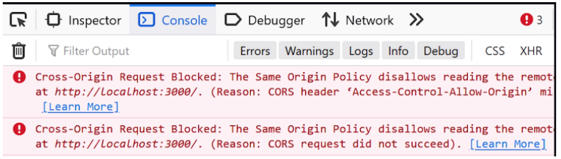

## SOP(Same-Origin-Policy)

- 웹 생태계에서 다른 출처로의 리소스 요청을 제한하는 정책중 하나로, **같은 출처**의 리소스만 공유할 수 있도록 제한하는 정책

### 같은 출처

- URL은 다음과 같은 요소로 구성되어 있음


- Protocol, Host, Port 번호가 같은 것을 의미
- 이중에서 Port번호는 각 웹에서 사용하는 프로토콜에 따라 기본 번호가 정해져있기 때문에 생략 가능

### SOP의 목적

- 주요 목적은 웹 애플리케이션의 보안을 강화하는 것
1. **크로스 사이트 스크립팅(XSS) 공격 방지**
- XSS 공격
    - 악성 스크립트가 사용자 웹 브라우저에서 실행되도록 만들어 민감한 정보를 탈취하거나, 웹 페이지의 동작을 조작하는 방식의 공격
- 스크립트가 다른 출처에서 실행되는 것을 막아 해당 공격을 제한함
2. **크로스 사이트 요청 위조(CSRF) 방지**
- CSRF 공격
    - 사용자가 방문한 신뢰할 수 있는 웹사이트에 이미 **로그인된 상태**에서, 공격자가 사용자를 속여 특정 악성 요청을 해당 웹사이트에 보내도록 유도하는 것.
    - 주로 사용자의 **쿠키나 세션 정보**를 이용해 실행됨
- SOP는 웹 애플리케이션이 다른 출처의 리소스에 대한 요청을 무단으로 보내는 것을 방지하여 CSRF공격으로부터 보호

### SOP의 한계

- SOP는 웹 보안을 강화하는 중요한 규칙이지만, 웹 애플리케이션이 다양한 출처의 API와 상호작용할 때 이러한 제약이 문제가 되어 개발에서 불편을 초래함
- 이를 해결하기 위해 **CORS**가 도입됨

## CORS(Cross-Origin Resource Sharing)

- 웹 브라우저에서 **다른 출처**의 리소스에 대한 요청을 허용하거나 차단하는 **보안 메커니즘**
- 동일 출처 정책(SOP)의 제약을 완화하여, 웹 애플리케이션이 자신과 **다른 출처의 서버**와 안전하게 데이터를 주고받을 수 있도록 함

### CORS 필요성

- 클라이언트 애플리케이션(프론트엔드)은 https://frontend.com에서 호스팅되고, 백엔드 API 서버는 https://api.backend.com에서 제공된다고 가정했을 때, 두 서버는 **다른 출처**에 있으므로, SOP에 의해 프론트엔드에서 API 호출이 차단됨
- 이를 해결하기 위해 **CORS**가 도입



### CORS 기본 동작

- **CORS는 HTTP 통신을 요청할 때 Header에 CORS와 관련된 정보를 추가적으로 입력하여 다른 출처의 자원에 접근할 수 있도록 함**
1. 내가 접속한 사이트 (클라이언트)에서 다른 출처의 사이트 (서버)로 리소스를 얻기 위한 HTTP Request 를 보낸다
2. 브라우저는 그 사이에서 **Request Headers** 에 `Origin` 이라는 필드에 `요청을 보내는 출처` (내가 지금 접속하고 있는 사이트)를 보낸다
    - Origin: https://github.com
3. 서버에서는 이 Request를 받아 **Response Headers**에 `Access-Control-Allow-Origin`이라는 필드에 접근이 허용되는 출처를 담아 응답한다
    
    ```
    // 보통 가장 많이 사용되는 값은 *(와일드 카드)이며 이는 모든 출처를 허용함을 의미한다
    Access-Control-Allow-Origin: *
    ```
    
4. 브라우저는 해당 Response에 `Access-Control-Allow-Origin` 와 Request에 `Origin` 을 비교하여 이 응답이 CORS가 허용되는 응답인지 아닌지 결정한다.
- 접속한 사이트가 요청이 허용되는 출처가 아니라면 브라우저는 아래와 같은 Error 내용을 보여줄 것이며 응답 값은 버려짐

```
Access to XMLHttpRequest at '외부 사이트' from origin '내가 접속한 사이트' has been
blocked by CORS policy: No 'Access-Control-Allow-Origin' header is
present on the requested resource
```

### 예상 면접 질문
1. 동일 출처 정책(SOP)이란 무엇이며, 필요성에 대해 설명해주세요.
2. CORS의 개념과 필요성에 대해 설명해주세요.
3. CORS의 동작 원리와 이를 통해 다른 출처의 리소스에 안전하게 접근하는 방법을 설명해보세요.
