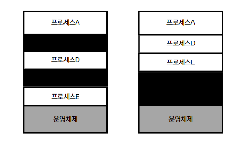

# 메모리 할당

## 연속 메모리 할당

페이징을 알기 전, 연속 메모리 할당에 대한 이해가 필요하다고 생각이 들어 **연속 메모리 할당**을 먼저 설명하려고 한다.

: 프로세스에 연속적인 메모리 공간을 할당하는 방식, 당연하다고 생각이 들 수 있지만

연속 메모리 할당

메모리를 효율적으로 사용하기 위해서 사용하지 않는 프로세스는 메모리 영역에서 제거하고 다른 프로세스에 메모리를 할당하게 된다(스와핑)

## 메모리 할당 방식

프로세스는 메모리 영역 빈공간에 적재되게 되는데, 비어있는 공간이 여러 개가 존재할 경우 어느 곳에 적재를 해야할까? 그 방법에는 크게 3가지 방식이 있다

### 1. 최초 적합 (First Fit)

운영체제가 메모리의 빈 공간을 찾다가 프로세스를 적재할 수 있는 공간을 찾게되면 바로 해당 공간에 적재를 하게 되는 방식이다. 찾는 즉시 적재를 하므로 연산을 최소화할 수 있다는 장점이 있다.

### 2. 최적 적합 (Best Fit)

운영체제가 메모리의 빈 공간을 모두 찾고, 적재되어야 할 프로세스의 용량과 가장 비슷한 공간에 적재하는 방식이다.

### 3. 최악 적합 (Worst Fit)

운영체제가 메모리의 빈 공간을 모두 찾고, 가장 큰 공간에 프로세스를 적재하는 방식이다.

## 외부 단편화 (External Fragmentation)

연속 메모리 할당으로 인해 여러 프로세스가 적재되고, 빠지고, 스와핑의 과정을 거치다 보면 빈 공간이 이어진 것이 아니라 부분부분 나누어져서 존재하게 된다.

아래의 사진처럼 하나의 60MB짜리 프로세스에 메모리 공간을 할당하고 싶어도 존재하는 빈 공간은 30MB뿐이므로 해당 프로세스를 적재하지 못하고, 메모리가 낭비된다는 문제점이 발생한다.

⇒ 이를 `외부 단편화` 라고 한다.

## 메모리 조각 모음

이를 해결하는 방법으로는, 단순하게 생각하면 해당 프로세스들을 압축시켜 빈 공간을 크게 만들어내는 방식을 생각할 수 있다. 아래 그림처럼

→ 하지만 이렇게 메모리에 존재하는 프로세스들을 재배치하고, 빈 공간을 하나로 만드는 과정은 시스템을 중단시키고, 많은 오버헤드를 발생시킨다는 단점이 있다.

그래서 이런 문제점을 해결하고자 `페이징(paging)` 기법이라는 방식을 사용한다.

# 페이징 (Paging)

## 페이징

프로세스의 **논리 주소 공간**을 `페이지(page)`라는 일정한 단위로 자르고, 메모리 **물리 주소 공간**을 `프레임(frame)`이라는 페이지와 동일한 크기의 단위로 잘라, 페이지를 프레임에 할당하는 가상 메모리 관리 기법

메모리를 효율적으로 사용하기 위해서는 스와핑을 적절히 사용해야한다. 하지만 이 경우에는 프로세스 전체가 아닌 페이지 단위로 스왑 인/아웃이 된다. 각각 **페이지 인(page in)**, **페이지 아웃(page out)**이라고 부른다.

이런 방식이 가능하다는 것은 프로세스를 실행하기 위해서는 프로세스 전체가 메모리에 적재될 필요가 없다는 것이다. 실행에 필요한 일부 페이지만 메모리에 적재하고, 필요하지 않은 페이지들은 보조 기억 장치에 둔다. 이때문에 물리 메모리보다 더 큰 프로세스를 실행할 수 있다.

## 페이지 테이블

프로세스의 논리 주소와 메모리의 물리 주소를 나누는 것 까지는 좋다. 근데 프로세스의 페이지가 여기저기 메모리에 흩어져서 나눠졌는데, 어느 프레임이 적재되어 있는지 CPU는 알 수가 없다. 프로세스가 메모리에 불연속적으로 배치되면 CPU 입장에서는 명령어가 실행될 때 다음, 또 다음 프레임에 접근하기가 어려워진다.

이를 해결하기 위해 **페이지 테이블**을 사용한다. 메모리의 물리 주소는 불연속적으로 배치 하더라도, 프로세스의 논리 주소는 연속적으로 배치한다. 그리고 페이지 테이블은 배치한 페이지 번호와 프레임 번호를 짝지어 준다.

## 내부 단편화 (Internal fragmentation)

페이징은 프로세스의 논리 주소 공간을 일정한 크기로 자른다. 하지만, 모든 프로세스의 크기가 페이지 크기의 배수가 아니라서 딱 맞게 떨어지지 않는다. 예를 들어, 페이지의 크기가 10KB인데 프로세스의 크기가 108KB라면 마지막 페이지는 2KB가 남게된다. 그렇다고 페이지의 크기를 줄이기엔 너무나 많은 페이지가 만들어져서 페이지 테이블이 차지하는 공간이 비대해질 수 있다.

→ 내부 단편화를 방지하면서 너무 크지 않은 테이블이 만들어지도록 적당한 크기로 페이지를 조정하는 것이 중요하다.

## 페이지 테이블 베이스 레지스터 - PTBR

프로세스마다 각자 프로세스 테이블을 갖고 있고, 페이지 테이블들은 메모리에 적재되어 있다. CPU내의 페이지 테이블 베이스 레지스터는 각 프로세스의 페이지 테이블이 적재된 주소를 가리키고 있다.

프로세스 A가 실행될 때 PTBR은 프로세스 A의 페이지 테이블을 가리키며, 프로세스 B가 실행될 때는 마찬가지로 PTBR은 프로세스 B의 페이지 테이블을 가리킨다. 그리고 접근한 페이지 테이블을 통해 페이지가 적재된 프레임을 알 수 있다.이러한 프로세스들의 페이지 테이블 정보는 각 프로세스의 PCB에 기록되며, 문맥 교환이 일어날 때 다른 레지스터와 마찬가지로 함께 변경된다.

접근 단계가 늘어나는 문제 해결 - TLB

위와 같은 방식으로 메모리에 접근을 하다보면 메모리 접근 단계가 한 단계가 더 늘어난다는 점이 있다. 테이블에 접근하기 위해 단계 한 번, 프레임에 접근하기 위한 단계 한 번, 총 두 번의 메모리 접근이 필요하다.

이런 문제를 해결하기위해 CPU 곁에 **TLB(Translation Lookaside Buffer)** 라는 캐시 메모리를 둔다. TLB는 테이블의 캐시이기 때문에 테이블의 일부 내용을 저장한다.

- TLB 히트 : CPU가 발생한 논리 주소에 대한 페이지 번호가 TLB에 있을 경우
- TLB 미스 : 반대로 페이지 번호가 TLB에 없을 경우
