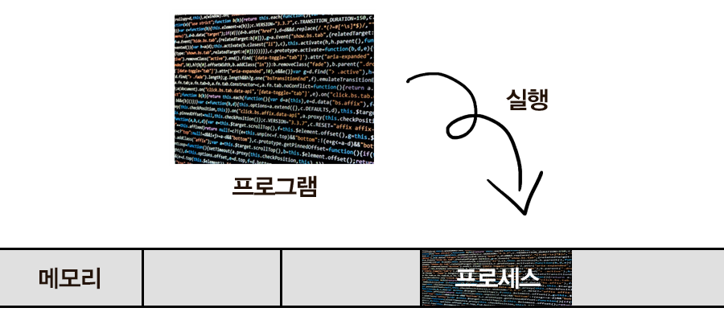
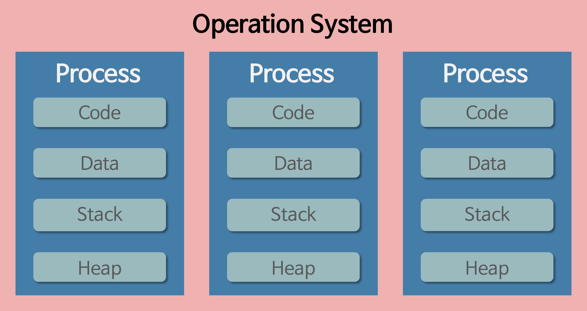
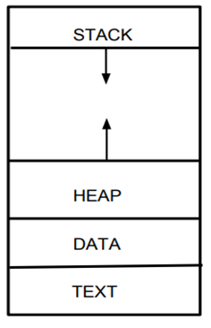
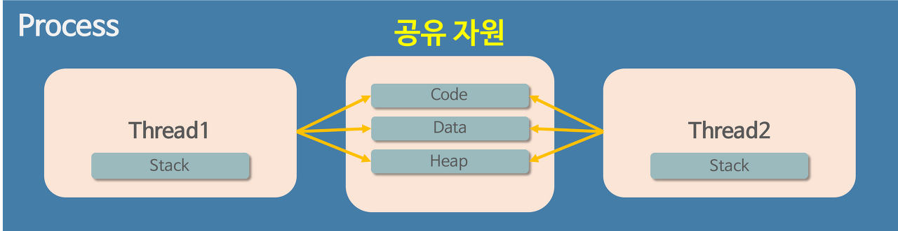

# 프로세스와 스레드

## 동작 방식

### **프로세스 (Process)**

: 운영체제로부터 자원을 할당받은 작업의 단위

### **프로그램 (Program)**

**프로그램 → 프로세스**

: 프로그램이란, 파일이 저장 장치에 저장되어 있지만, **메모리에는 올라가 있지 않은 정적인 상태 → .exe, .dmg 등 실행하기 전의 파일**

프로그램을 실행시키게 될 경우, 해당 파일은 컴퓨터 메모리에 올라가게 되고 동적인 상태가 된다 ⇒ 실행되고 있는 컴퓨터 프로그램 : 프로세스 (위키피디아)

### **스레드 (Thread)**

**프로세스 → 스레드**

: 프로세스가 할당받은 자원을 이용하는 실행 흐름의 단위

시간이 흐르면서 프로그램이 복잡해지고 프로세스 하나만으로 프로그램을 처리하기엔 무리였다. 그래서 한 프로그램을 여러 프로세스가 처리할 수 있도록 생각했지만 이는 불가능에 가까운 일이다.
→ 운영체제는 안정성을 위해서 프로세스마다 할당된 메모리 내의 정보에만 접근할 수 있도록 제약을 두고, 이를 벗어나는 정보에 접근하려면 오류가 발생한다.

프로세스와 다른 더 작은 실행 단위 개념인 스레드(Thread)가 나왔다.

- 보통 하나의 프로세스당 한 개 이상의 스레드를 보유한다.

## 프로세스 작동 방식

- 운영체제는 프로세스에게 각각 Code/Data/Stack/Heap의 형식으로 독립된 메모리 영역을 할당해준다.
- 각각 독립된 메모리 영역에 프로세스를 할당해주기 때문에 다른 프로세스에 접근할 수 없다.

### 프로세스의 자원 구조

STACK, HEAP영역은 동적영역이라 화살표가 쳐져있다

- 코드 영역 (Code/Text) : 프로그래머가 작성한 프로그램의 함수들의 코드
- 데이터 영역 (Data) : 코드가 실행되면서 사용되는 전역 변수나 각종 데이터들
  - .data : 전역 변수 또는 static 변수 등 프로그램이 사용하는 데이터를 저장
  - .rodata : const같은 상수키워드 선언 된 변수나 문자열 상수 저장
  - .BSS : 초기값 없는 전역 변수, static 변수 저장
- 스택 영역 (Stack) : 지역 변수와 같은 호출한 함수가 종료되면 되돌아올 임시적인 자료를 저장하는 독립적인 공간. Stack은 함수의 호출과 함께 생성되고 함수의 호출이 완료되면 소멸한다. 만약 stack 영역을 초과하면 stack overflow 에러가 발생한다.
- 힙 영역 (Heap) : 생성자, 인스턴스와 같은 동적으로 할당되는 데이터들을 위해 존재하는 공간. 사용자에 의해 메모리 공간이 동적으로 할당되고 해제된다.

## 스레드 동작방식

- 스레드는 프로세스와 다르게 Stack영역만 각각 할당받고, Code/Data/Heap영역은 같이 공유하게 된다.
- 그렇기 때문에 다른 스레드에도 접근이 가능하다.
- 하지만 이런 부분때문에 하나의 스레드에서 오류가 발생할 경우 같은 프로세스내의 영역을 공유하고 있는 다른 스레드들도 모두 강제로 종료가 된다.

## 다른 프로세스의 정보에 접근하는 방법

1. IPC(Inter-Process Communication)

- IPC가 필요한 이유
- Shared Memory & Message Passing
  1. 정보 공유 (Information Sharing)
  2. 가속화 (Computation Speed-up)
  3. 모듈화 (Modularity)
  4. 편의성 (Convenience)

2. LPC(Local inter-Process Communication)
3. 별도로 공유 메모리를 만들어서 정보를 주고받도록 설정

## 예상질문

1. 프로세스와 스레드의 차이에 대해서 설명해주세요
2. 프로세스의 자원 구조에 대해서 설명해주세요
3. 스레드의 동작 방식에 대해 설명해주세요

### 레퍼런스

- https://velog.io/@raejoonee/프로세스와-스레드의-차이
- https://velog.io/@chanyoung1998/Inter-Process-CommunicationIPC-프로세스-간-통신
