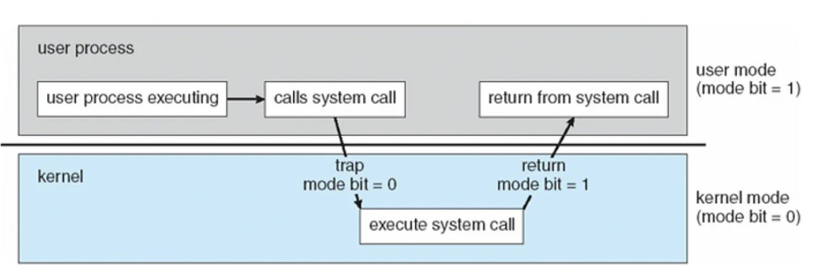

## 커널 모드 VS 사용자 모드

CPU가 실행하는 2가지 실행 모드로, CPU에게 주어진 실행 권한에 따라서 구분함

### 커널 모드

- 운영 체제의 핵심 부분인 커널이 실행되는 모드로, **CPU에게 가장 높은 실행 권한을 부여하는 모드**
- 커널이 하드웨어 자원에 직접 접근이 가능하고, 다양한 하드웨어 자원을 직접 관리할 수 있음
- 운영체제의 핵심 기능(프로세스 관리, 파일 시스템, 메모리 관리 등)을 수행할 수 있으며, **모든 종류의 명령을 다 실행**할 수 있음
- 보안을 해칠 수 있는 중요한 명령어는 커널 모드에서만 수행 가능한 ‘**특권 명령**’으로 규정되어 있음

### 사용자 모드

- 애플리케이션 등 사용자 프로그램이 실행되는 모드로, CPU에게 가장 낮은 실행 권한을 부여
- **하드웨어 자원에 직접 접근이 불가능하며, 사용자 모드에서는 제한적인 명령만을 수행**할 수 있음

### 2가지의 모드로 구분하는 이유

- 사용자 프로세스에서 하드웨어에 접근하여 잘못된 명령어를 실행함으로써 시스템 전체가 다운되거나 치명적인 오류가 발생하는 것을 막기위한 일종의 보호장치
- 이를 통해 운영체제는 보안적으로 안전한 환경을 제공하고, 악의적인 프로그램의 공격에 대해 대응력을 높일 수 있음

## 시스템 콜(System Call)이란?

- 응용 프로그램의 요청에 따라 커널에 접근하기 위한 인터페이스
- 시스템콜은 커널 영역의 기능을 사용자 모드가 사용 가능하게, 즉 응용프로그램이 시스템콜을 사용해서 원하는 기능을 수행할 수 있게 해줌
- 프로그래밍 언어들은 시스템콜을 편리하게 사용하기 위한 수단으로 API를 제공함

## 시스템 콜 동작 내부 구조

- 만약 응용프로그램이 System call을 호출하여 사용하면, 해당 애플리케이션은 커널모드로 잠시 전환되어 CPU 자원에 접근할 수 있음

1. 사용자 프로세스가 시스템 콜 호출(커널 모드 진입)
2. 커널은 내부적으로 시스템 콜을 구분하기 위해 기능별로 **고유번호를 할당**하고 그 번호에 해당하는 제어 루틴을 정의 → 시스템콜테이블
   - **시스템콜테이블**: 시스템 콜 번호에 대응하는 함수 포인터를 저장하고 있어, 운영 체제가 올바른 시스템 콜 함수를 호출할 수 있도록 함
3. 커널은 요청받은 시스템 콜에 대응하는 고유번호를 확인하고 번호에 맞는 서비스 루틴 호출
4. 커널은 서비스 루틴을 처리, 사용자 모드로 전환

## 시스템 콜 종류

1. 프로세스 제어(Process Control)

프로세스 실행, 생성, 대기 등

- fork()
- exec()
- wait()
- exit()

2. 파일 조작(File manipulation)

파일 열기, 읽기, 쓰기 등

- open()
- read()
- write()
- close()

3. 장치 관리(Device management)

디바이스 부착, 분리, 읽기, 쓰기 등

- ioctl()
- read()
- write()

4. 정보 유지(Information maintenance)

날짜, 시간 설정등

- getpid()
- alarm()
- sleep()

5. 통신(Communication)

통신 연결 생성, 제거, 상태 정보 전달 등

- pipe()
- shm_open()
- mmap()

## 시스템 콜 사용

- C언어
  - C언어의 경우 직접 메모리에 접근이 가능하여, 시스템콜 사용에 가장 적합
  - `unistd.h`라이브러리에서 제공하는 함수들을 통해 시스템 콜을 쉽게 사용
- 파이썬
  - `os` , `subprocess`표준 라이브러리
  - https://tempdev.tistory.com/46https://hbase.tistory.com/341
  - https://hbase.tistory.com/341
- 자바
  - 일반적으로 **운영 체제와의 직접적인 상호작용을 피하는 고수준 언어**
  - java.io와 java.nio 같은 패키지를 통해 파일 입출력이나 네트워크 작업을 수행
  - 만약 더 직접적으로 시스템 콜에 접근하고 싶다면, **JNI(Java Native Interface)**를 사용
    - 이는 자바 프로그램에서 C로 작성된 시스템 콜을 호출할 수 있게 해줌

## 면접질문

- 시스템 콜이 무엇인지 설명해주세요
- 시스템 콜의 유형에 대해 설명해주세요
- 서로 다른 시스템 콜을 어떻게 구분할 수 있을까요?

## 레퍼런스

[https://velog.io/@rlvy98/CS-시스템-콜System-Call#-시스템-콜system-call-사용](https://velog.io/@rlvy98/CS-%EC%8B%9C%EC%8A%A4%ED%85%9C-%EC%BD%9CSystem-Call#-%EC%8B%9C%EC%8A%A4%ED%85%9C-%EC%BD%9Csystem-call-%EC%82%AC%EC%9A%A9)

[https://velog.io/@no-int/JAVA자바의-시스템-콜feat.JNI](https://velog.io/@no-int/JAVA%EC%9E%90%EB%B0%94%EC%9D%98-%EC%8B%9C%EC%8A%A4%ED%85%9C-%EC%BD%9Cfeat.JNI)

https://spongerice.tistory.com/207

https://github.com/VSFe/Tech-Interview/blob/main/02-OPERATING_SYSTEM.md
